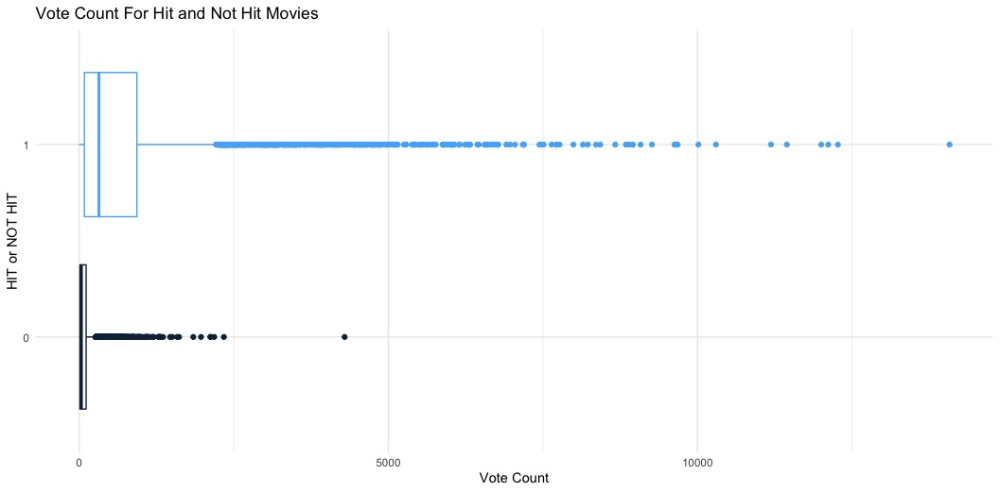

# Summary:
A Movie can be classified as a successful movie or a ' hit' based on the revenue it earns for the budget put into its making. Of course, the story of the Movie plays a vital role in determining that. However, there could be hidden patterns in the movie attributes that have more influence over others in deciding whether a movie will be a hit or not. By analyzing various attributes of a movie, this project aims to achieve that.
The project consisted of Exploratory Data Analysis and Statistical Modelling of a movies database from Kaggle – "The Movies Dataset". This database consisted of attributes such as Cast, Crew, Plot keyword, Budget, Revenue, Posters, Release date, Languages, Production, Companies, Countries, IMDB votes, IMDB Ratings, and Vote average.

# The Movie Dataset: 
This is the primary data set. It contains data of ~45k movies and has following columns: 
- Adult: A Boolean flag that tells whether a movie was ‘Adult’ rated or not
- Belongs to collection: Tells the collection a movie belongs to (e.g., Lord of the Rings collection)
- Budget: The budget of a movie. However, budget will be sourced from a different file as this column contains a lot of missing values 
- Genres: All the genres of a movie Homepage: URL Link to the homepage of a 
- movie ID: Numeric ID of a movie IMDB ID: Standard 9 Character IMDB ID of the format <ttxxxxxxx>
- Original Language: Keys of Original Language of the movie in encoded as a key (e.g., ‘en’ for English) 
- Original Title: Original title of the movie in original language script 
- Overview: Summary about the story of the movie 
- Popularity: Continuous variable with a popularity score 
- Poster Path: JPG Image file name of the movie poster 
- Production Companies: Production house of a movie 
- Production Countries: Production countries of a movie 
- Release Date: Release date of a movie. 
- Revenue: Revenue earned. However, revenue will be sourced from a different file as this column contains a lot of missing values 
- Run-time: Run-time of a movie in minutes Spoken 
- Languages: All languages of the movie in {key:value} 
- format Status: Categorical variable showing status of the 
- movie Tagline: Tagline of a movie 
- Title: Title of the movie in English 
- Vote Average: IMDB rating of a movie. However, ratings data will be sourced from a different file as this column contains lot of discrepancies 
- Vote Count: #Ratings of a movie

# Exploratory Data Analysis:
Data scientists with the help of Exploratory data analysis (EDA) analyze and explore datasets and document important characteristics utilizing data visualization methods. It helps determine how best to manipulate data sources to get the answers needed, and enables data scientists to discover patterns, identify anomalies, test hypotheses, or test assumptions. EDA is mainly used for figuring out what information can be inferenced other than formal modeling or hypothesis testing, which gives a better insight of the variables in a data and the correlations between them. It can also help determine if the statistical method considered is suitable for analyzing the data. First developed by American mathematician John Tukey in the 1970s, the EDA method is still widely used in data retrieval processes.

 

## Distribution of the Response Variable:	
Feature Engineered the response variable based on the ratio of already existing variables named revenue and budget. If the ratio of the revenue to budget comes out to be greater than 1, meaning profits were generated, it was marked as a HIT movie, or was not a hit otherwise. The Distribution of the response variable can be depicted from the visualization shown in the class balance of y-variable in figure 1. There were approximately 51.4% of movies designated as hit and the remaining as not.

## Correlation Heat map: 
A heat map describes the measure of relationship between variables on one axis with the variables on the other axis. According to the palette used here, the lighter the color the greater the relationship, meaning that if the correlation coefficient lies in the range 0 to 1, the greater the value the more positive relationship and if the correlation coefficient lies in the range 0 to -1, the lesser the value the more negative relationship and all the relationships depicted on the diagonals are just the correlation of the variables with themselves.
 

The correlation heat map shown in the figure evinces the correlation of all the different genres present in the dataset.  From the correlation map, how one genre can lead to probability of other genre being present in a combination with it. For instance, correlation of ‘war’ and ‘history’ tells us that if there is a movie about ‘war’, there is a probability that it is historical or if it’s about ‘history’ it is most likely about ‘war’. Same applies to ‘Thriller’ and ‘crime’, ‘Adventure’ and ‘Family’, and many more combinations.

# MODELLING:

Modelling is the methodology of trying to make a Machine Learning model to take in our dataset and predict a target variable. It also includes minimizing error, optimizing feature weights and evaluating the model against different metrics such as Accuracy, Precision, Recall, F1-score, Area Under the Curve (AUC) etc. Four supervised machine learning models such as Logistic Regression, Decision Tree, KNN and Random Forest were chosen as models to train and test with our dataset.

-	LOGISTIC REGRESSION:
		Logistic regression is a statistical that uses a logistic function to model a binary dependent variable. In regression analysis, logistic regression (or logit regression) is estimating the parameters of a form of binary regression. Mathematically, a binary logistic model has a dependent variable with two possible values which is represented by an indicator variable, where the two values are labeled either 0 or 1.
-	K-NEAREST NEIGHBOURS (kNN):
			The nearest neighbor (kNN) algorithm in is a nonparametric classification method. Used for classification and regression. In either case, the input consists of the k closest training examples in the data set. Results depend on whether kNNs are used for classification or regression
-	DECISION TREE:
			A decision tree is a flowchart-like structure in which each inner node represents a "test" for an attribute (such as whether a coin toss is a heads or tails), each branch represents a test result, and each leaf node represents a class. brand. (Determined after calculating all properties). The path from root to leaf is a classification rule.

-	RANDOM FOREST:
			Random Forests or Random Decision Forests are ensemble training techniques for classification, regression, and other problems that work by constructing multiple decision trees during training. For classification problems, the output of a random forest is the class chosen from most trees. For regression problems, the mean or mean prediction of the individual trees is returned.
# RESULTS:

## Visualizations

•	There is no strong correlation between the year a movie was released and whether it will be hit/not. 
•	Another inference is that as time passes by, the number of hit as well not/hit movies have increased.

•	There is strong correlation between surprising factors like Drama which has negative correlation with our target variable.
•	Movies from Countries like Belgium, Luxembourg has positive correlation with our target variable.
•	Family centered genres like Animation, Comedy, Family have strong correlation with our target feature.

•	Popularity has a positive relationship with our target variable.
•	Popularity is relatively more right skewed for Hit movies
•	The mean popularity is higher for hit movies.
•	Both Hit and Not Hit movies are right skewed for Popularity

•	Vote Count has a positive relationship with our target variable.
•	Vote Count is relatively more right skewed for Hit movies
•	The mean Vote Count is higher for hit movies.
•	Both Hit and Not Hit movies are right skewed for Vote Count

•	Hit Movies have a higher IMDB scores than non-Hit movies

•	It can be inferred that Family, Animation and Adventure genres have higher percentage of hit movies which is also reflected in the correlation Matrix 
•	On the other hand, Drama has a negative correlation which can be inferred from the adjacent figure also.

## Model

|     Model                  |     Specificity    |     Accuracy    |     Precision    |     F1-Score    |     Recall/Sensitivity    |     AUC       |
|----------------------------|--------------------|-----------------|------------------|-----------------|---------------------------|---------------|
|     Logistic Regression    |     1.0            |     100         |     1.0          |     1.0         |     1.0                   |     1.0       |
|     kNN                    |     0.9908         |     99.27       |     0.9913       |     0.9929      |     0.9945                |     0.9927    |
|     Decision Tree          |     0.8219         |     85.38       |     0.8395       |     0.8612      |     0.8840                |     0.8529    |
|     Random Forest          |     0.9527         |     95.27       |     0.9554       |     0.9538      |     0.9538                |     0.9527    |

•	A basic model such as Logistic regression and kNN performed better with our dataset when compared to complex models like decision Tree.
•	The reason Decision Tree has the worst, among the four, evaluation metrics might be due to presence of outliers in our training set.
